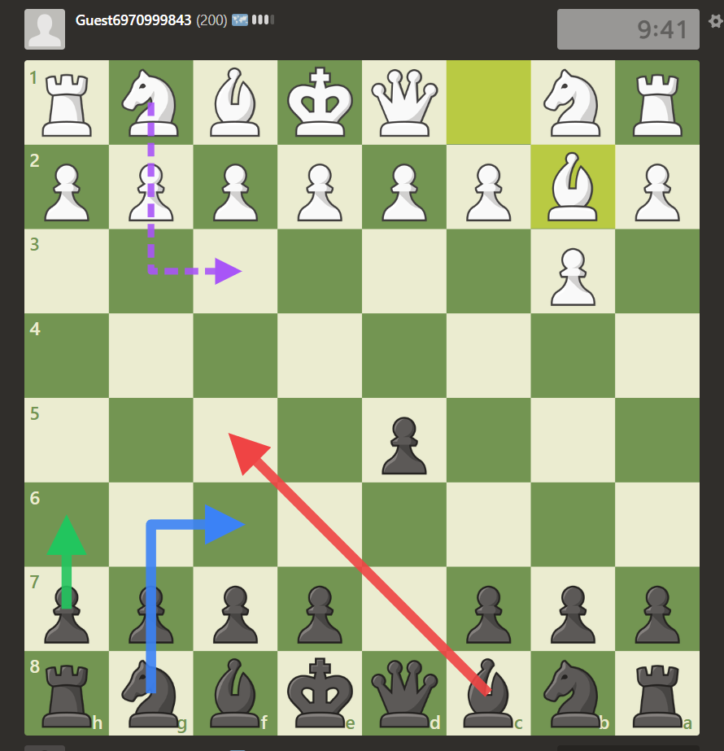

# Chess Analyzer



A lightweight, minimalist browser extension for real-time chess analysis.

> **Note:** A userscript version of this tool is also available in the [chess-userscript](https://github.com/peenjeee/chess-userscript) repository.

## Features

- Sites: Works on **chess.com** and **lichess.org**.
- Engine: Full-strength Stockfish 18 NNUE (~113MB, downloaded once and cached), with chess.com's built-in engine as a fallback. On lichess, suggestions come instantly from the lichess cloud evaluation (depth 60+), with the local engine as a fallback.
- Fast Parsing: Extracts FEN from the DOM instantly (piece classes on chess.com, piece transforms on lichess).
- Visual Overlays: Draws SVG arrows (Blue, Green, Red) to indicate top moves. Knights use L-shaped paths.
- Turn Detection: Automatically reads the current turn and board orientation.
- Pondering: Displays anticipated opponent replies via dashed lines.
- Live Relay: Press **Ctrl+Shift+C** to copy your **Relay ID** — enter it in the [Chess Analyzer web app](https://chess.0xpnj.dev) (**Live** tab → **Session ID**) to mirror your game with engine suggestions on another device, with a full Game Review when it ends. No persistent relay UI.
- Hotkeys: Show/hide the move suggestions with the 'A' key (starts/stops the analyzer), and hide or show the Analyze button with the 'Insert' key.

> `scripts/main.js` is generated from `userscript.js` in the [chess-userscript](https://github.com/peenjeee/chess-userscript) repository — edit it there.

## Installation

### 1. Clone the Repository
Open your terminal and clone the repository using Git:
```bash
git clone https://github.com/peenjeee/chess-analyzer.git
```

### 2. Load into Browser
1. Open your browser's extensions page (`edge://extensions/` or `chrome://extensions/`).
2. Enable "Developer Mode".
3. Click "Load unpacked" and select the extension directory.
4. The extension is now ready to use on supported pages.

## Usage

1. Open a chess game.
2. Press 'A' on your keyboard to toggle the analyzer overlay.
3. Follow the arrow guides on the board.
4. Press 'Insert' to hide or show the analyzer button (the 'A' hotkey keeps working while it is hidden).

## Troubleshooting

- **Analyzer is stuck or arrows don't appear:** If the engine stops responding or the arrows freeze, simply press the **'A'** key twice (to turn it off and on again). This will instantly reset the engine memory and resync it with the current board position.
